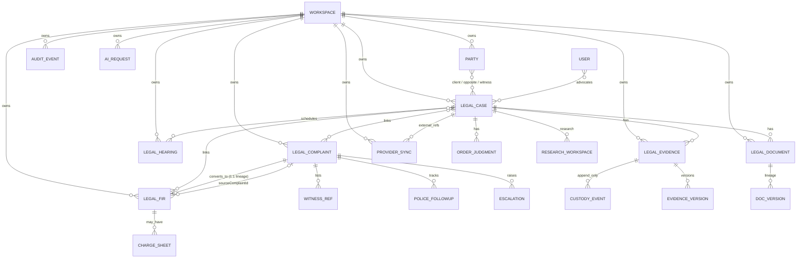

# LegalOS Entity-Relationship Diagram

## Mermaid ER

## Collections & indexes

| Collection | Core relationships | High-value indexes |
| --- | --- | --- |
| `legal_cases` | clientPartyIds[], oppositePartyIds[], advocateIds[], complaintIds[], firIds[] | `{workspaceId,status,nextHearingAt}`; `{workspaceId,court.cino}`; text(caseNumber,title,partiesSearch) |
| `legal_complaints` | clientPartyId, oppositePartyIds[], policeStationId?, convertedFirId?, linkedCaseId? | unique sparse `{workspaceId,complaintNumber}`; `{workspaceId,status,nextFollowUpAt}` |
| `legal_firs` | clientPartyId, officerPartyId?, linkedCaseId?, sourceComplaintId? | unique sparse `{workspaceId,firNumber,policeStationKey}`; `{workspaceId,bailStatus}` |
| `legal_evidence` | caseId?, complaintId?, firId?, storageKey, custodyEvents[] | `{workspaceId,sha256}`; `{workspaceId,caseId,occurredAt}` |
| `legal_hearings` | caseId, assignedAdvocateIds[], court snapshot | `{workspaceId,scheduledAt,status}`; `{workspaceId,caseId,scheduledAt}` |
| `legal_documents` | caseId?, evidenceId?, template/version lineage | `{workspaceId,caseId,type,createdAt}`; `{workspaceId,checksum}` |
| `legal_provider_syncs` | provider, entityType, entityId, externalKey, status | unique `{workspaceId,provider,entityType,externalKey}`; `{nextRunAt,status}` |
| `legal_audit_events` | entityType, entityId, actorId, correlationId | `{workspaceId,entityType,entityId,occurredAt}` |

## Standard audit fields

All mutable models include: `workspaceId`, `createdBy`, `updatedBy`, `createdAt`, `updatedAt`, `deletedAt`, `version` (optimistic concurrency).

## Complaint → FIR rule

Conversion **never overwrites** the complaint. It creates a FIR with `sourceComplaintId`, sets `complaint.convertedFirId`, appends an audit event `CONVERTED_TO_FIR`, and rejects duplicate conversion with `COMPLAINT_ALREADY_CONVERTED`.
